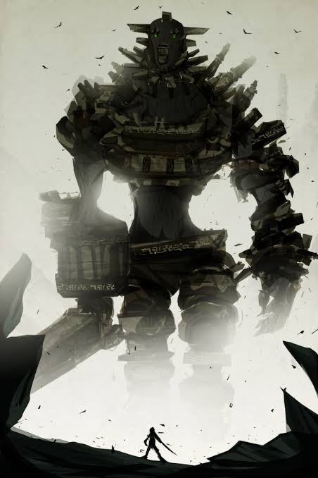

# How do you make money in a silver rush?

Note:
Open with the question. Pause and let the room think before moving on.

---

Note:
Answer the question with the family story: you sell picks and shovels.
Details to fill in:
- Where he came from and when he arrived in Tombstone
- What his store was called and what he sold
- How it turned out for him compared with the miners

---

# Today's gold rush: building businesses with AI

So what's the shovel?

Note:
AI has made it possible for far more people to start building businesses. Those builders are today's miners.

---

## The shovel: a business-building pipeline.

Note:
Don't sell to one stage of a builder's journey. Build a pipeline that carries them from idea to business.

---

## Five stages. Each one feeds the next.

1. 1:1 Coaching
2. Consulting & Contracting
3. Equity Partners
4. Marketing Partnerships
5. Builder Platform

The pipeline gets built while it's already running.

Note:
Give the overview, then walk through each stage. On every stage slide, point out what it hands to the next one.

---

### Stage 1

## 1:1 Coaching

Build a clientele and a stronger network, one builder at a time.

→ Clients who need more than advice become consulting clients.

Note:
Where it starts. Every coaching client is also a new connection in the network.

---

### Stage 2

## Consulting & Contracting

Go from advising builders to building alongside them.

→ The strongest projects become candidates for equity partnerships.

Note:

---

### Stage 3

## Equity Partners

Take equity in startups looking for partners.

→ A portfolio of startups that need customers.

Note:

---

### Stage 4

## Marketing Partnerships

Partner with marketing firms to promote our equity partners.

→ Everything learned in stages 1–4 becomes a product.

Note:

---

### Stage 5

## Builder Platform

A platform that lets early builders explore their ideas quickly and easily.

→ Builders who find a real idea come back to Stage 1.

Note:
This closes the loop: the platform feeds new clients back into coaching.

---

Note:
